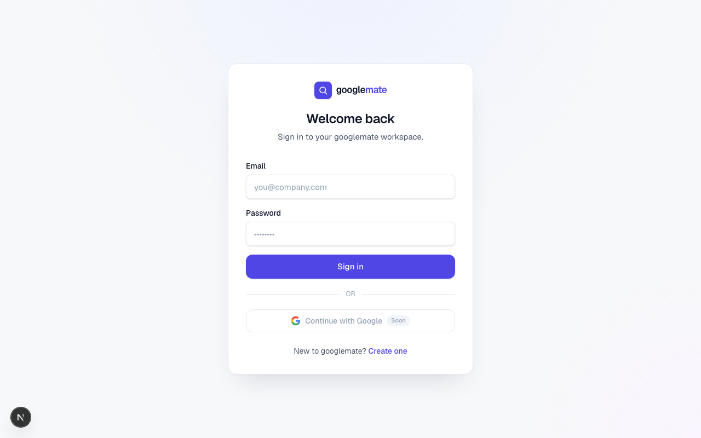

# googlemate

**Live:** https://googlemate.100dayaichallenge.com

A local-business lead-gen tool for agencies, freelancers, and anyone who sells
services to local businesses. Search a location and niche, and googlemate finds
businesses on Google, ranks the best-fit prospects through your own business
lens, and hands you a ready-to-send pitch for each one.

Day 16 of Savion's 100 Day AI Build Challenge (one new app per day for 100 days).

## What it does

1. **Search** a location and keyword (or let AI suggest niches for your business).
2. Google Places returns up to 30 businesses; your AI ranks them through your
   business profile and keeps your chosen number of best-fit prospects. The rest
   are saved as hidden results, and already-seen businesses are deduped out of
   future scans.
3. Each surviving lead gets a **profile**: a photo banner, review sentiment meter
   and word cloud, first-impressions analysis, a directory/NAP consistency check,
   and a **ready-to-send pitch email** in your voice that references a real review.
4. **Send** the pitch through your own webmail (Gmail/Outlook/Yahoo auto-detected,
   including custom domains via MX lookup) or copy it.

Bring your own AI key (Anthropic or OpenAI) on the Settings page; Google Places
is provided by the app. CRM connection (HighLevel and more) is coming soon.

## Screenshot



## Stack

Next.js 16 (App Router) + TypeScript + Tailwind v4 + Supabase (email/password auth
and Postgres with RLS). AI via the Anthropic or OpenAI SDK (the user's key,
server-side only).

## Install

```bash
git clone https://github.com/Still-InFrame/day-16-googlemate.git
cd day-16-googlemate
npm install
cp .env.local.example .env.local   # fill in Supabase + GOOGLE_PLACES_API_KEY
npm run dev
```

Open http://localhost:3000, create an account, add your AI key and business
profile in Settings and My Business, then run a scan.

## Links

- Tracker: https://www.100dayaichallenge.com/share/savion
